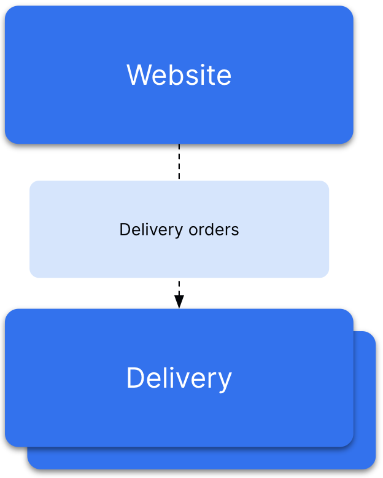
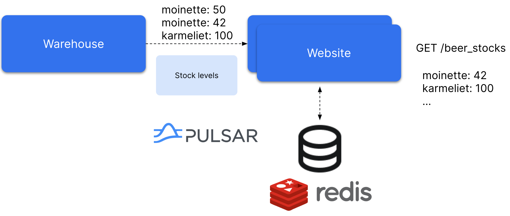

# Goals

This demo aims to illustrate the Pulsar subscription modes through a code walkthrough and a demo with [Spring for Apache Pulsar](https://docs.spring.io/spring-pulsar/docs/1.0.0/reference/index.html).

This demonstrates how the Pulsar subscription model provides:
- elastic scalability of the consumer without the need to create partitions on the broker side
- a unified API for both messaging & streaming

This also demonstrates how easy it is to code a Pulsar client Spring Boot app.

# Prerequisites

- Maven 3.8.7 or higher
- JDK 17 or higher
- Docker
- curl
- jq - https://jqlang.github.io/jq/

This demo is tested on MacOS. It should work on Linux as well.

Build the project:
```bash
mvn clean package
```

# Background

As the owner of a Belgian beer reseller company, you specialize in online sales and delivering your products directly to customers. 
Given the success and growing demand of your online store, scalability has become a priority. 
To meet this need and streamline your operations, you've chosen [Pulsar](https://pulsar.apache.org/) as a unified platform for handling both messaging and streaming use cases.

# Use-case #1: messaging



When an order for beer is placed, the website forwards it to the delivery service. 
This service is tasked with delivering the order directly to the customer's home. 
However, the delivery service isn't designed to manage the performance and availability demands of a website. 
To address this, we need a message queue to separate the delivery operations from the website's functions. 
The website publishes delivery orders to a delivery-orders-topic topic. 
Below is an example of what a delivery order looks like:

```json
{
  "parcelNumber": 41,
  "timestamp": "2023-03-10T10:54:07.574714Z",
  "articlesNumber": 2,
  "address": "16 RUE EUGENE BOULY 59400 CAMBRAI"
}
```

Website & Delivery are Spring Boot microservices.

In this demo, the Website service sends a random delivery order to the topic every 200ms. 

The addresses list is a random sample of the [French national addresses open database](https://adresse.data.gouv.fr/).

## One instance

### Step 1: build & launch the Website service

Run the following commands in a terminal:

```bash
cd website
docker compose up -d # This launches a standalone Pulsar and a Redis database.
java -jar target/*website*jar
```

### Step 2: build & launch the Delivery service

Run the following commands in another terminal window:

```bash
cd delivery
java -jar target/*delivery*jar
```

### Step 3: messages consumption

You should now see messages being consumed:

```
2023-03-10T15:46:38.745+01:00  INFO 54419 --- [ntainer#0-0-C-1] o.a.p.demo.delivery.DeliveryConsumer     : **** Delivery order received **** {"parcelNumber":26,"timestamp":"2023-03-10T14:46:38.647528Z","articlesNumber":1,"address":"2 ALLEE PIERRE SERVEL 56000 VANNES               "}
2023-03-10T15:46:39.759+01:00  INFO 54419 --- [ntainer#0-0-C-1] o.a.p.demo.delivery.DeliveryConsumer     : **** Delivery order received **** {"parcelNumber":27,"timestamp":"2023-03-10T14:46:39.652370Z","articlesNumber":2,"address":"41 RUE HENRI PLOYART 59260 HELLEMMES LILLE       "}
```

## Scaling the consumption

With the increase in order volume, it's necessary to scale the Delivery service. 
To do this, open two additional terminal windows and launch a new instance of the Delivery service in each.

```bash
cd delivery
java -jar target/*delivery*jar
```

You now have 3 Delivery service instances.

You should see the messages being delivered to each of the Delivery services instances in a round-robin fashion. Pulsar balances the load among these three consumers.

The **Shared** subscription enables this behavior.

## Walking through the code

### Consumer

Open the `DeliveryConsumer`class from the `delivery` module to see how the Delivery service consumes the messages. 

The `PulsarListener` annotation has specified a `Shared`subscription type.

For more information on how this annotation works, refer to the [Spring for Apache Pulsar](https://docs.spring.io/spring-pulsar/docs/1.0.0/reference/index.html) documentation. 

### Producer

Open the `DeliveryProducer` class from the `website` module to see how the website service produces the messages. It leverages the `PulsarTemplate`API.

For more information, refer to the [Spring for Apache Pulsar](https://docs.spring.io/spring-pulsar/docs/1.0.0/reference/index.html) documentation.

# Use-case #2: Data Streaming



The Website service offers real-time visibility of Belgian beer stock levels through the /beer_stock REST endpoint, with data stored in a Redis database. 
Stock level changes, like a replenishment of Moinette beer in the warehouse, trigger the Warehouse service to publish a message with the updated stock level to a topic. 
The Website service then reads these messages to refresh the stock data in Redis. 
To ensure scalability, multiple instances of the Website service will be run in parallel.

<aside>
⚠️ Please note that this architecture is not suitable for production. But it is simple for the sake of the demo.

</aside>

Below is an example of a `BeerStock`event:
```
beerName: Moinette
stockLevel: 42
```

## Getting the current stock level

### Step 1: launch the Redis database & Pulsar

```bash
cd website
docker compose up -d
```

### Step 2: build & launch the Warehouse service

Run the following commands in a terminal:

```bash
cd warehouse
java -jar target/*warehouse*jar
```

### Step 3: produce stock level messages

Run the following command in another terminal window:
```bash
curl -s -X POST "http://localhost:9099/produce"
```
Now, in the terminal, you should see a list of events sent by the Warehouse service to a topic:

```
Sent {"beerName":"Chimay","stockLevel":6}
Sent {"beerName":"Chouffe","stockLevel":2}
Sent {"beerName":"Chimay","stockLevel":4}
Sent {"beerName":"Moinette","stockLevel":43}
Sent {"beerName":"Karmeliet","stockLevel":140}
Sent {"beerName":"Moinette","stockLevel":41}
Sent {"beerName":"Moinette","stockLevel":39}
Sent {"beerName":"Moinette","stockLevel":42}
Sent {"beerName":"Karmeliet","stockLevel":141}
Sent {"beerName":"Karmeliet","stockLevel":142}
Sent {"beerName":"Chimay","stockLevel":1}
Sent {"beerName":"Chimay","stockLevel":0}
Sent {"beerName":"Chouffe","stockLevel":0}
```

### Step 4: build & launch the Website service

Kill any running Website service instance.

Run the following commands in another terminal:

```bash
cd website
java -jar target/*website*jar
```

Run a second instance of the Website service in a third terminal:

```bash
java -jar target/*website*jar --server.port=9091
```

You'll notice that only one consumer instance processes the beer stock messages while the other remains inactive. 
This behavior is due to the **Failover** subscription type used here. 
In this setup, Pulsar delivers messages exclusively to a single consumer within the same subscription. 
If you terminate the active consumer instance, Pulsar will then route the messages to the other instance.

### Step 5: get the current stock level

Call the API REST endpoint. The URL is: `http://localhost:9090/beer_stocks`

You will get the following payload:

```json
[
  {
    "beerName": "Moinette",
    "stockLevel": 42
  },
  {
    "beerName": "Chouffe",
    "stockLevel": 0
  },
  {
    "beerName": "Chimay",
    "stockLevel": 0
  },
  {
    "beerName": "Karmeliet",
    "stockLevel": 142
  }
]
```

Remember the events sequence:

```
Sent {"beerName":"Chimay","stockLevel":6}
Sent {"beerName":"Chouffe","stockLevel":2}
Sent {"beerName":"Chimay","stockLevel":4}
Sent {"beerName":"Moinette","stockLevel":43}
Sent {"beerName":"Karmeliet","stockLevel":140}
Sent {"beerName":"Moinette","stockLevel":41}
Sent {"beerName":"Moinette","stockLevel":39}
Sent {"beerName":"Moinette","stockLevel":42}
Sent {"beerName":"Karmeliet","stockLevel":141}
Sent {"beerName":"Karmeliet","stockLevel":142}
Sent {"beerName":"Chimay","stockLevel":1}
Sent {"beerName":"Chimay","stockLevel":0}
Sent {"beerName":"Chouffe","stockLevel":0}
```

The last known stock level for Moinette is 42, 142 for Karmeliet & 0 for the others.

So the payload is right. Everything happened as expected.

### Step 6: automate

Step 3 & 5 can be run in a loop so you don't have to repeat them during the demo.
You can the following script
:
```bash
cd website
./update_stocks.sh
```

Every second, the script produces stock messages and reads the stock value.

You can see that, because we are using the **Failover** mode, the stock values are always accurate.

## Scaling - attempt #1 - Shared subscription mode

If the volume of events becomes too high for a single consumer instance to handle, we need to add more instances.

However, due to the failover mode, only one instance can consume events within the same subscription.

As discussed earlier in the Messaging section, using the **Shared** subscription mode allows scaling out by balancing the load across multiple consumer instances.

Let's switch to a **Shared** subscription and observe the results.

Open the `BeerStockConsumer` class in the `website` module.

Locate the subscription type:

```java
@PulsarListener(subscriptionName = "beer-stocks-sub", 
            topics = "beer-stocks-topic", 
            subscriptionType = SubscriptionType.Failover)
```

Replace `Failover` with `Shared`

Kill any running instance of the Website service.

Rebuild & launch the Website service:

```bash
cd website
mvn package
java -jar target/*website*jar
```

In another terminal, launch a second instance of the Website service:

```bash
java -jar target/*website*jar --server.port=9091
```

Wait a few seconds, then run the `update_stocks.sh` script.

You will get different payloads. Many of them will have **wrong** stock levels:

```json
[
  {
    "beerName": "Moinette",
    "stockLevel": 39 // Should be 42
  },
  {
    "beerName": "Chouffe",
    "stockLevel": 0
  },
  {
    "beerName": "Chimay",
    "stockLevel": 1 // Should be 0
  },
  {
    "beerName": "Karmeliet",
    "stockLevel": 142
  }
]
```

What happens?

You may see in the logs that the messages are not consumed in the right order. So a consumer may save a stale stock level to the Redis database. 

This explains why sometimes the stock value is wrong.

## Scaling - attempt #2 - Key_Shared subscription mode

Open the `BeerStockConsumer` class in the `website` module.

Locate the subscription type:

```java
@PulsarListener(subscriptionName = "beer-stocks-sub", 
            topics = "beer-stocks-topic", 
            subscriptionType = SubscriptionType.Shared)
```

Replace `Shared` with `Key_Shared`

Kill any running instance of the Website service.

Rebuild & launch the Website service:

```bash
cd website
mvn package
java -jar target/*website*jar
```

In another terminal, launch a second instance of the Website service:

```bash
java -jar target/*website*jar --server.port=9091
```

Wait a few seconds, then execute the update_stocks.sh script to view the results. 

This time, you can expect to see accurate stock levels consistently.

```json
[
  {
    "beerName": "Moinette",
    "stockLevel": 42
  },
  {
    "beerName": "Chouffe",
    "stockLevel": 0
  },
  {
    "beerName": "Chimay",
    "stockLevel": 0
  },
  {
    "beerName": "Karmeliet",
    "stockLevel": 142
  }
]
```

What happens?

If you examine the logs closely, you'll notice that Pulsar consistently delivers stock level updates for the same beer to the same consumer. 
This ensures that messages for each beer are processed in the correct order. 
Consequently, consumers always record the most recent stock level in the Redis database. 
This process guarantees the accuracy of the stock values.

This works because the messages are produced using the `beerName` as the **key**. 

Let's see how you can produce a message with a key using the `PulsarTemplate`.

Open the `BeerProducer` class from the `warehouse` module.

Locate the `produce` method.

We’re using the fluent API to customize the message production. Here we use the `beerName` as the message key.

```java
pulsarTemplate.newMessage(message)
                    .withMessageCustomizer(c -> c.key(b.getBeerName()))
                    .withTopic("beer-stocks-topic")
                    .send();
```

# What to do next

- [Reach out to me](https://streamnative.io/people/julien?utm_source=devrel&utm_medium=beerfactorydemo&utm_campaign=spring) to get more demos and move through your journey to Pulsar.
- [Join the Pulsar Community Slack](https://communityinviter.com/apps/apache-pulsar/apache-pulsar).
- Subscribe to the [StreamNative Youtube channel](https://www.youtube.com/channel/UCywxUI5HlIyc0VEKYR4X9Pg) and [read our blog](https://streamnative.io/blog) to learn more about Pulsar.
- Try out [StreamNative’s managed Pulsar](https://streamnative.io/deployment/hosted?utm_source=devrel&utm_medium=beerfactorydemo&utm_campaign=spring).

